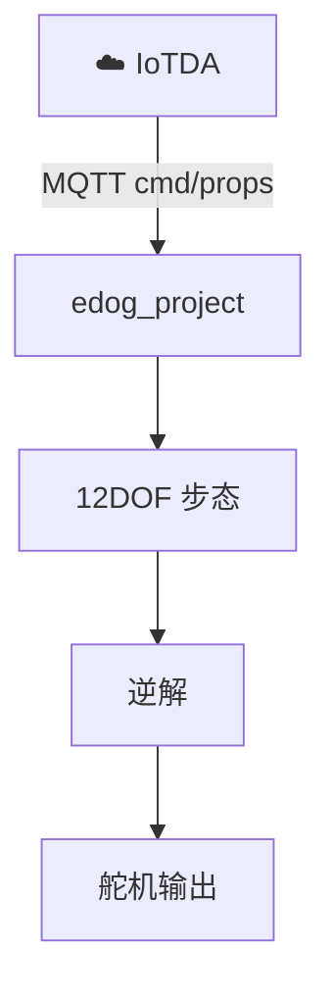

<div align="center">

# 🐕 EDOG Firmware · edog_project

**软通动力通晓开发板（RK2206）** · OpenHarmony LiteOS · 12DOF

[](https://github.com/yangzhiyong3508/edog_project_docker)
[](https://github.com/yangzhiyong3508/edog_project_docker)
[](https://github.com/yangzhiyong3508/edog_project_docker)

<p><b>从 MQTT 命令到四条腿落地——机载运动栈在这里。</b></p>

</div>

---

## ✨ 能力清单

| | 模块 | 内容 |
|:---:|:---|:---|
| 📶 | 连接 | Wi‑Fi STA + 华为云 IoTDA MQTT |
| 📨 | 命令 | `motion_control`：trot / 转向 / stop / `*_coze` 有限步 |
| 🎛️ | 属性 | 机身高度差、髋收展、腿长、`speed_level` … |
| 🦴 | 运动 | 12DOF 步态生成 + 逆解（`12_DOF_Version/`） |
| 🧪 | 测试 | `tools/test_12dof_*.py` 契约与回归 |



---

## 🗂️ 目录结构

```text
Docker_Edog/
├── BUILD.gn
├── include/              # edog_config · local example
├── src/                  # main · wifi_mqtt_task
├── utils/                # iot · motion · servo · mqtt · wifi
├── 12_DOF_Version/       # 步态与运动学
└── tools/                # 校验脚本
```

硬件与工程路径：软通动力（iSoftStone）通晓开发板，源码对应  

`vendor/isoftstone/rk2206/samples/edog_project`

---

## 🔑 本地配置（必做）

```bash
cp include/edog_config.local.example.h include/edog_config.local.h
```

填写 Wi‑Fi、IoTDA 设备 ID / MQTT 用户名 / 设备密钥 / 接入地址。  

⛔ **`edog_config.local.h` 禁止提交**（已 gitignore）。

---

## 🔨 编译提示

在 OpenHarmony LiteOS 完整树 + Docker/本地工具链中编译本模块，按通晓（RK2206）开发板文档产出烧录镜像。

```bash
# 若从容器拷贝源码
docker cp <container>:/path/to/samples/edog_project/. ./
```

---

## 🧪 测试

```bash
python tools/test_12dof_gait_ik.py
# 更多：tools/test_12dof_*.py
```

---

## 🔗 云端与 App

- 服务 ID：`Edog`  
- 命令 / 属性协议与 [SpringBoot](https://github.com/yangzhiyong3508/SpringBoot) 的 `RobotMotionService`、`DogDebugService` 对齐  

| 端 | 链接 |
|----|------|
| 主仓 | [Edog_powered_by_rk2206](https://github.com/yangzhiyong3508/Edog_powered_by_rk2206) |
| 后端 | [SpringBoot](https://github.com/yangzhiyong3508/SpringBoot) |
| App | [Application](https://github.com/yangzhiyong3508/Application) |
| 图传 | [ESP32](https://github.com/yangzhiyong3508/ESP32) |

<div align="center">

🦿 调得动 · 走得稳 · 跟得上

</div>
